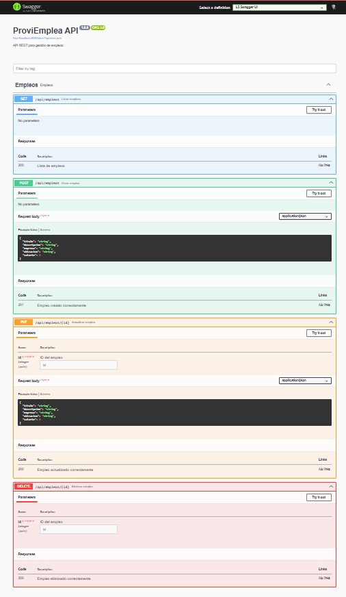
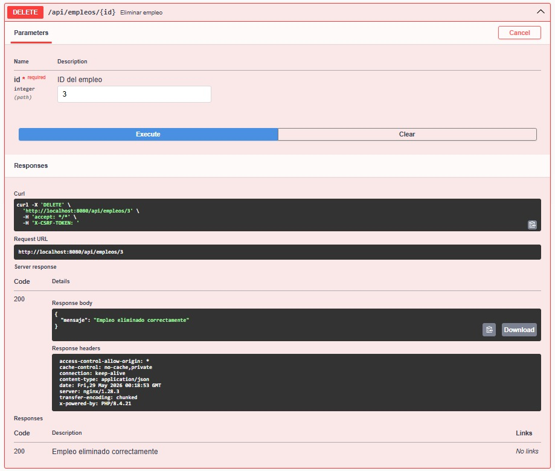
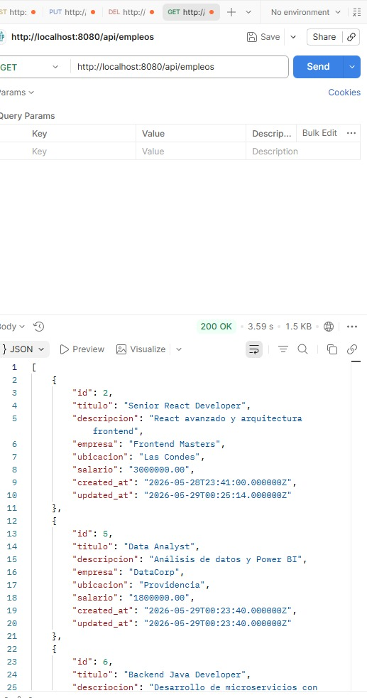
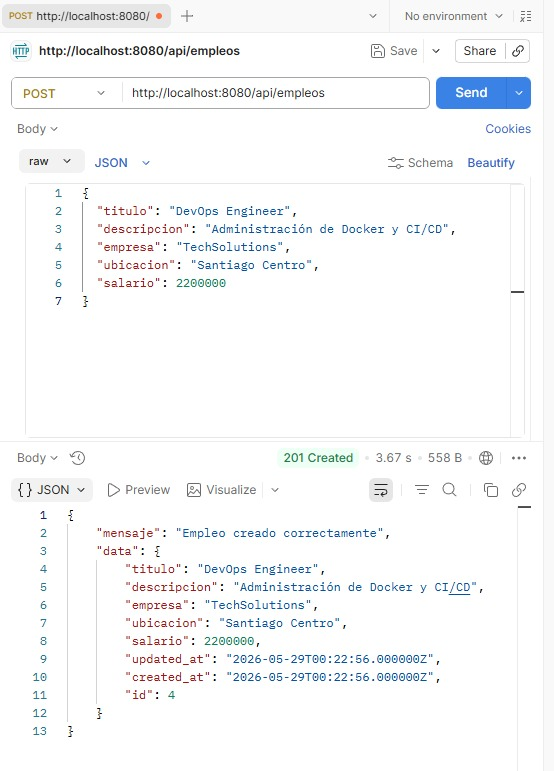
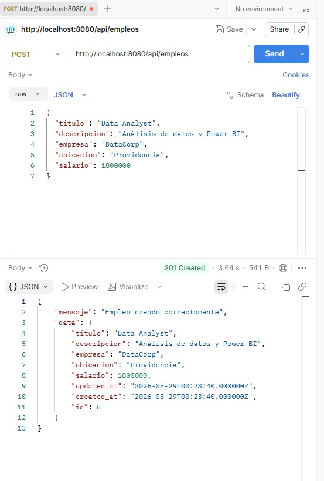
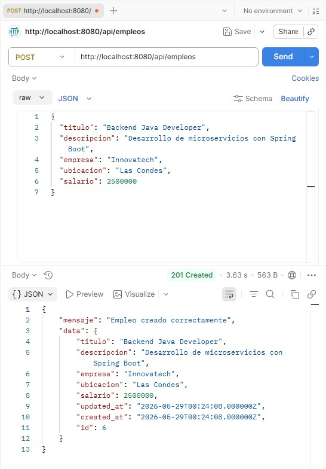
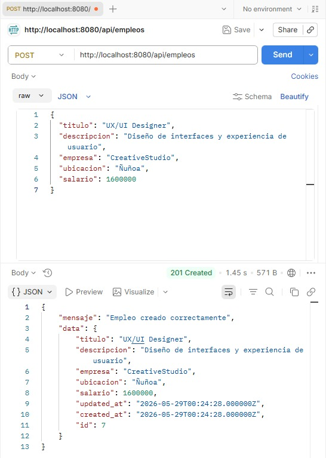
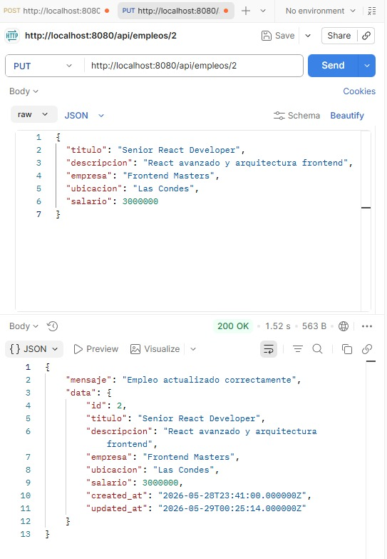
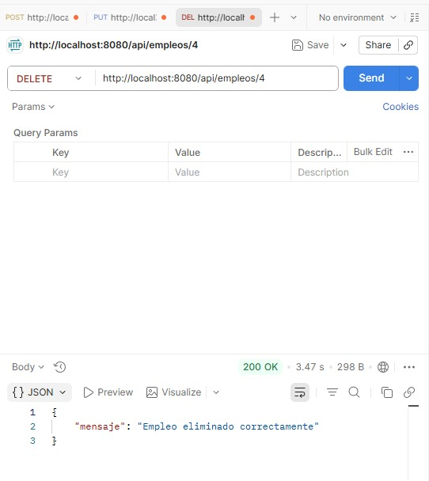
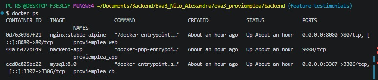

# ProviEmplea API

API REST desarrollada con Laravel 11 para la gestión de talento y empleabilidad, utilizando Docker, MySQL, Swagger (OpenAPI) y Postman.

---

# Descripción del Proyecto

ProviEmplea API es un sistema backend desarrollado como una API RESTful para la gestión integral de empleabilidad. Permite administrar perfiles de personas (talentos), empresas y procesos de contacto laboral, implementando un enfoque de CV ciego para la evaluación imparcial de candidatos.

La aplicación fue desarrollada con Laravel 11, ejecutada en contenedores Docker, utilizando MySQL como base de datos relacional, y Swagger (OpenAPI 3.0) para la documentación interactiva de la API.

---

## Arquitectura del Sistema

El proyecto sigue una arquitectura MVC (Model - View - Controller) adaptada a API REST:

- Controllers: manejo de endpoints y lógica HTTP
- Models: interacción con base de datos MySQL
- Requests/Validation: validación de datos de entrada
- Swagger (OpenAPI): documentación automática de endpoints
- Docker: entorno de desarrollo aislado y replicable
- Postman: pruebas funcionales de la API

---

# Tecnologías Utilizadas

- Laravel 11
- PHP 8.4
- MySQL 8
- Docker
- Docker Compose
- Nginx
- Swagger (L5 Swagger)
- Postman

---

# Funcionalidades Implementadas

La API permite:

**Gestión de Personas (Talentos)**

- Crear perfiles de talento
- Listar talentos (CV ciego)
- Actualizar información profesional
- Eliminar/desactivar perfiles
- Validación de perfiles

**Gestión de Empresas**

- Registro de empresas
- Actualización de datos empresariales
- Validación de empresas
- Eliminación lógica de registros

**Sistema de Contactos**

- Registro de solicitudes empresa–talento
- Gestión de estados del proceso (pendiente, entrevista, seleccionado, etc.)
- Control de etapas de contratación

**Administración**

- Estadísticas generales de la plataforma
- Control de procesos de reclutamiento

**General**

- API REST completa
- Documentación automática con Swagger
- Contenedores Docker funcionales
- Persistencia de datos con MySQL
- Pruebas realizadas con Postman

---

# Estructura del Proyecto

```text
EVA3_PROVIEMPLEA/
└── backend/
    ├── app/
    │   ├── Http/
    │   │   └── Controllers/
    │   │       └── Api/
    │   │           ├── EmpleoController.php
    │   │           └── Controller.php
    │   ├── Models/
    │   │   ├── Empleo.php
    │   │   └── User.php
    │   ├── Providers/
    │   └── Swagger/
    │       └── SwaggerAnnotations.php
    ├── bootstrap/
    │   ├── cache/
    │   ├── app.php
    │   └── providers.php
    ├── capturas/
    │   ├── delete-empleo.png
    │   ├── docker-containers.png
    │   ├── get-empleos.png
    │   ├── post-empleo-1.png
    │   ├── post-empleo-2.png
    │   ├── post-empleo-3.png
    │   ├── post-empleo-4.png
    │   ├── put-empleo.png
    │   ├── swagger-delete.png
    │   └── swagger-home.png
    ├── config/
    │   ├── app.php
    │   ├── auth.php
    │   ├── cache.php
    │   ├── database.php
    │   ├── filesystems.php
    │   ├── l5-swagger.php
    │   ├── logging.php
    │   ├── mail.php
    │   ├── queue.php
    │   ├── services.php
    │   └── session.php
    ├── database/
    ├── docker/
    │   ├── nginx/
    │   │   └── default.conf
    │   └── php/
    │       └── Dockerfile
    ├── public/
    ├── resources/
    ├── routes/
    ├── storage/
    ├── tests/
    ├── vendor/
    ├── .editorconfig
    ├── .env
    ├── .env.example
    ├── .gitattributes
    ├── .gitignore
    ├── artisan
    ├── composer.json
    ├── composer.lock
    ├── docker-compose.yaml
    ├── package.json
    ├── phpunit.xml
    ├── postcss.config.js
    ├── README.md
    ├── tailwind.config.js
    └── vite.config.js
```

---

# Configuración y Ejecución del Proyecto

## 1. Clonar el repositorio

```bash
git clone URL_DEL_REPOSITORIO
```

---

## 2. Ingresar al proyecto

```bash
cd eva3_proviemplea/backend
```

---

## 3. Levantar contenedores Docker

```bash
docker compose up -d --build
```

## 4. Instalar dependencias

```bash
docker compose exec app composer install
```

---

## 5. Configuración del entorno (.env)

El proyecto utiliza un archivo .env para la configuración global de la aplicación, incluyendo base de datos, entorno y URL del sistema.

### 5.1 Crear archivo de entorno

```bash
cp .env.example .env
```

**Variables de entorno principales**

- APP_NAME → Nombre del proyecto
- APP_URL → URL local (http://localhost:8080)
- DB_CONNECTION → tipo de base de datos (mysql)
- DB_HOST → host de la base de datos (en Docker: mysql)
- DB_PORT → puerto de MySQL (3306)
- DB_DATABASE → nnombre de la base de datos del proyecto
- DB_USERNAME → usuario de la base de datos
- DB_PASSWORD → contraseña de la base de datos

**Generar la clave de la aplicación:**

Una vez configurado el entorno, se debe generar la clave de Laravel:

```bash
docker compose exec app php artisan key:generate
```

## 6. Verificar contenedores activos

```bash
docker ps
```

---

## 7. Ejecutar migraciones

```bash
docker compose exec app php artisan migrate
```

---

## 8. Generar documentación Swagger

```bash
docker compose exec app php artisan l5-swagger:generate
```

---

# URLs del Proyecto

## Laravel

```plaintext
http://localhost:8080
```

---

## Swagger

```plaintext
http://localhost:8080/api/documentation
```

---

# Endpoints de la API

| Método | Endpoint          | Descripción               |
| ------ | ----------------- | ------------------------- |
| GET    | /api/empleos      | Obtener todos los empleos |
| POST   | /api/empleos      | Crear un empleo           |
| PUT    | /api/empleos/{id} | Actualizar un empleo      |
| DELETE | /api/empleos/{id} | Eliminar un empleo        |

---

# Ejemplo de JSON para Crear Empleo

```json
{
    "titulo": "Backend Developer",
    "descripcion": "Desarrollo con Laravel y Docker",
    "empresa": "ProviEmplea",
    "ubicacion": "Santiago",
    "salario": 1200000
}
```

---

# Evidencias del Proyecto

## Swagger principal



---

## Swagger DELETE



---

## GET empleos



---

## POST empleo 1



---

## POST empleo 2



---

## POST empleo 3



---

## POST empleo 4



---

## PUT empleo



---

## DELETE empleo



---

## Docker Containers



---

# Pruebas Realizadas

Las pruebas fueron realizadas utilizando Postman y Swagger UI, verificando:

- Creación de registros (201 Created)
- Consultas exitosas (200 OK)
- Validación de errores (422 Unprocessable Entity)
- Recursos no encontrados (404)
- Conflictos de datos (409)
- Persistencia en MySQL
- Consistencia entre Swagger y endpoints reales

## Estado del Proyecto

- API REST funcional
- Arquitectura MVC implementada
- Swagger/OpenAPI operativo
- Docker configurado correctamente
- Base de datos MySQL conectada
- Pruebas en Postman realizadas
- Evidencias visuales incluidas

---

# Resultado Final

El proyecto ProviEmplea API se encuentra completamente funcional, con arquitectura escalable, documentación interactiva y entorno de desarrollo reproducible mediante Docker, cumpliendo los requerimientos de una API REST profesional de nivel académico y portafolio.

---

# Autor

Alexandra Nilo
